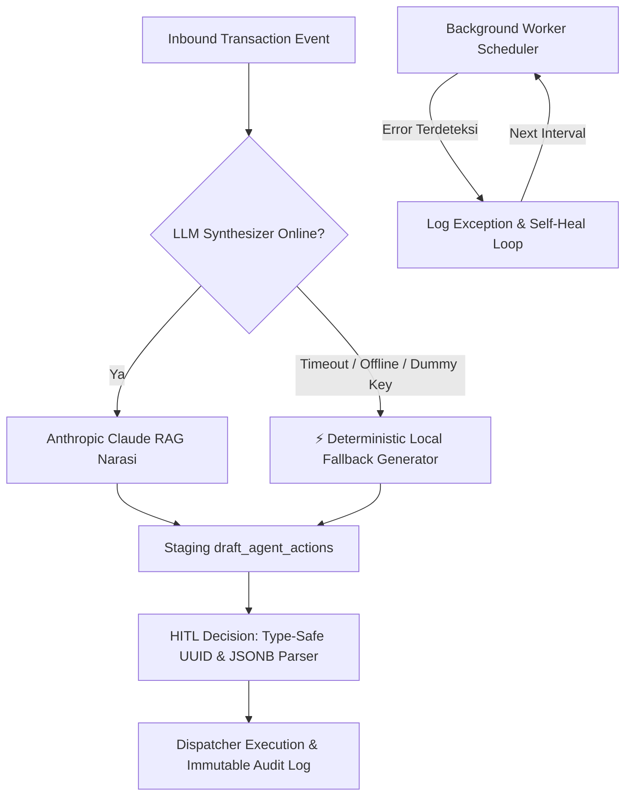

# Product Requirements Document (PRD)
## Batu Networks ERP — Agentic AI Orchestration Engine
**Versi:** 10.11 (Living Document)  
**Terakhir Diperbarui:** 2026-09-05  
**Status:** In Active Development / Phase 1–3 Integrated  
**Target Lingkungan:** Batu Networks ERP Extension Layer (Y3 Technologies)

---

## 1. Eksekutif & Latar Belakang Produk

### 1.1 Latar Belakang
Batu Networks beroperasi di 5 entitas hukum Asia Pasifik (**Singapura (HQ)**, **Vietnam**, **Korea Selatan**, **India**, dan **Jepang**) yang menangani transaksi pengadaan, penjualan, logistik lintas negara (*Triangle Trade*), dan kliring multi-valas dengan volume tinggi.

Untuk mencegah risiko human error, keterlambatan backlog, serta inefisiensi manual, dibangun **Agentic AI Orchestration Engine** yang bertindak sebagai *asisten kognitif terpercaya*.

### 1.2 Filosofi Desain Inti
Sistem ini menganut prinsip ketat **"Zero Hallucination Business Critical"**:
1. **Deterministic Separation of Concerns:** Semua kalkulasi matematis (margin kotor, penalti MOQ, selisih kurs, skor komposit, deviasi RDD) dieksekusi 100% oleh Python secara murni tanpa intervensi LLM.
2. **Cognitive Narrative (RAG Grounded):** Anthropic Claude 3.5 bertindak murni menyusun teks narasi formal, surat klarifikasi, atau draf penawaran yang terikat ketat (*grounded*) pada payload JSON deterministik.
3. **Human-in-the-Loop (HITL) Gateway:** Tidak ada mutasi transaksi ERP atau pengiriman pesan keluar yang dieksekusi tanpa persetujuan manual staf berwenang via tabel staging `draft_agent_actions`.
4. **Read-Only Database Replica:** Beban komputasi analitik dan pemindaian proaktif terisolasi penuh dari database transaksi utama ERP.

---

## 2. Multi-Tenant Legal Entity Partition

Sistem menerapkan isolasi data ketat berbasis kode entitas:

| Kode Entitas | Wilayah Operasional | Mata Uang Utama | Fungsi Entitas |
|---|---|---|---|
| **SG** | Singapore HQ | SGD / USD | Hub Keuangan, Pengadaan Regional, Triangle Trade |
| **VN** | Vietnam SSC | VND | Shared Services Center, Back-Office Support |
| **KR** | Korea Branch | KRW | Penjualan Komponen Telekomunikasi & Pengadaan Lokal |
| **IN** | India Office | INR | Logistik Pendukung & Dukungan Teknis |
| **JP** | Japan Office | JPY | Sourcing Vendor Spesialis & Distribusi Regional |

---

## 3. Spesifikasi Rinci 9 Agen AI

### 3.1 Agen 1: Quotation Response Assistant
- **Fase:** Phase 2 (Validation Agent)
- **Modul ERP:** `PS01` (Inbound RFQ & Sourcing)
- **Fungsi:** Auto-matching RFQ katalog harga vs kebutuhan parallel sourcing.
- **Logika Deterministik:**
  - Jika `unit_cost` ada di master price: `selling_price = unit_cost / (1 - (target_margin_pct / 100))` -> Tindakan: `GENERATE_CUSTOMER_QUOTE`.
  - Jika tidak ada: Tindakan `DISPATCH_PARALLEL_SOURCING_RFQ` ke 3 vendor terdaftar.
- **Endpoint:** `POST /api/v1/agents/agent-1/process-rfq`
- **Halaman UI:** `/agents/agent-1`

### 3.2 Agen 2: SO/PO Mismatch Pre-Checker
- **Fase:** Phase 2 (Validation Agent)
- **Modul ERP:** `PS02` (Contract Margin & MOQ Guardrail)
- **Fungsi:** Menghitung margin kotor deterministik dan menegakkan batas minimum MOQ pemasok.
- **Logika Deterministik:**
  - `gross_margin = ((so_price - po_cost) / so_price) * 100`
  - Margin Breach jika `gross_margin < 15.0%`.
  - MOQ Breach jika `ordered_qty < moq`.
  - Rekomendasi solusi kuota MOQ jika tier-2 price tersedia.
- **Endpoint:** `POST /api/v1/agents/agent-2/validate-po`
- **Halaman UI:** `/agents/agent-2`

### 3.3 Agen 3: Backlog & Exception Narrator
- **Fase:** Phase 1 (Foundation Pilot Agent)
- **Modul ERP:** `PS06 / PS07` (Backlog SLA & Delivery Exception)
- **Fungsi:** Deteksi keterlambatan Request Delivery Date (RDD) vs ETA & penentuan tingkat keparahan.
- **Logika Deterministik:**
  - `delta_days = (eta - rdd).days`
  - Severity: `NORMAL` (<= 3 hari), `WARNING` (4–14 hari), `CRITICAL` (> 14 hari).
  - Eskalasi otomatis disiapkan untuk tingkat `WARNING` dan `CRITICAL`.
- **Endpoint:** `POST /api/v1/agents/agent-3/evaluate-rdd`
- **Halaman UI:** `/agents/agent-3`

### 3.4 Agen 4: Price Validity & Renewal Agent
- **Fase:** Phase 2 (Validation Agent)
- **Modul ERP:** `PS03` (Master Price Renewal)
- **Fungsi:** Radar proaktif mendeteksi master price yang akan kedaluwarsa dalam 30 hari (H-30) & membuat bulk Excel renewal.
- **Logika Deterministik:**
  - Polling terjadwal via `worker.py` (interval 15 menit).
  - Indeks inflasi rekomendasi +2.1%.
- **Endpoint:** Otomatis via Background Worker Scheduler.
- **Halaman UI:** `/agents/agent-4`

### 3.5 Agen 5: Vendor Performance Advisor
- **Fase:** Phase 1 (Foundation Pilot Agent)
- **Modul ERP:** `PS07` (Supplier Scorecard & Allocation)
- **Fungsi:** Evaluasi performa vendor komposit dan penetapan alokasi kuota pengadaan.
- **Logika Deterministik:**
  - Bobot skor: On-Time Delivery 40%, Kualitas Inspeksi QA 40%, Variansi Harga Pasar 20%.
  - Tiering:
    - **Tier 1 (Preferred):** Skor >= 88.0 -> Alokasi 70% kuota batch.
    - **Tier 2 (Standard):** Skor 70.0–87.9 -> Alokasi 30% kuota batch.
    - **Tier 3 (Restricted):** Skor < 70.0 -> Alokasi 0% (pemblokiran PO otomatis).
- **Endpoint:** `POST /api/v1/agents/agent-5/evaluate-vendor`
- **Halaman UI:** `/agents/agent-5`

### 3.6 Agen 6: GR Discrepancy Handler
- **Fase:** Phase 2 (Validation Agent)
- **Modul ERP:** `IN01 / IN05` (Inbound Dock & Goods Receipt)
- **Fungsi:** Pemisahan penerimaan gudang (Valid Partial GR vs Klaim Debit RMA barang rusak).
- **Logika Deterministik:**
  - `valid_gr_qty = scanned_qty - damaged_qty`
  - `debit_claim_amount = damaged_qty * unit_cost`
  - Auto-draft nota retur barang rusak (RMA) dan voucher partial GR.
- **Endpoint:** `POST /api/v1/agents/agent-6/handle-gr`
- **Halaman UI:** `/agents/agent-6`

### 3.7 Agen 7: Triangle Trade & Borrowed Stock
- **Fase:** Phase 3 (Deep Sync Agent)
- **Modul ERP:** `BRD 6.3` (Triangle Trade & Inter-Partner Stock Loan)
- **Fungsi:**
  1. Verifikasi Proof of Delivery (POD) forwarder untuk posting sinkron Logical GR/GI tanpa sentuh gudang fisik Singapura.
  2. Radar jatuh tempo pinjaman stok antar-mitra (maks 30 hari, alert H-5).
- **Logika Deterministik:**
  - `maturity_date = borrowed_date + timedelta(days=max_loan_days)`
  - `days_left = (maturity_date - date.today()).days`
  - Peringatan H-5 untuk pengembalian fisik barang.
- **Endpoints:**
  - `POST /api/v1/agents/agent-7/verify-triangle`
  - `POST /api/v1/agents/agent-7/check-loan-maturity`
- **Halaman UI:** `/agents/agent-7`

### 3.8 Agen 8: AR/AP Multi-Currency Reconciler
- **Fase:** Phase 3 (Deep Sync Agent)
- **Modul ERP:** `AC02` (Bank Matching & FX Accounting)
- **Fungsi:** Rekonsiliasi mutasi rekening bank multi-valas dan alokasi selisih kurs transaksi vs settlement.
- **Logika Deterministik:**
  - `fx_variance = (amount_foreign * settle_rate) - (amount_foreign * book_rate)`
  - Jika negatif: **FX Loss** -> Akun Buku Besar `7210`.
  - Jika positif: **FX Gain** -> Akun Buku Besar `7110`.
- **Endpoint:** `POST /api/v1/agents/agent-8/reconcile-bank`
- **Halaman UI:** `/agents/agent-8`

### 3.9 Agen 9: Cash Flow & Loan Narrative
- **Fase:** Phase 1 (Foundation Pilot Agent)
- **Modul ERP:** `AC01 / AC02` (Treasury & Cash Runway)
- **Fungsi:** Pemantauan sisa runway likuiditas operasional mingguan dan mitigasi denda pinjaman Open Account (OA).
- **Logika Deterministik:**
  - `net_usable_cash = current_cash - loan_due_7days`
  - `weeks_runway = net_usable_cash / weekly_burn_rate`
  - Status:
    - **HEALTHY:** >= 4.0 minggu.
    - **TIGHT:** 2.0 s/d 3.9 minggu.
    - **CRITICAL DEFICIT:** < 2.0 minggu atau kas bersih minus (alert otomatis ke CFO).
- **Endpoint:** `POST /api/v1/agents/agent-9/assess-cash-runway`
- **Halaman UI:** `/agents/agent-9`

---

## 4. Skema Basis Data PostgreSQL

### 4.1 Tabel Staging: `draft_agent_actions`
Menampung seluruh draf sebelum disetujui staf berwenang.
```sql
CREATE TABLE draft_agent_actions (
    id UUID PRIMARY KEY DEFAULT uuid_generate_v4(),
    agent_id VARCHAR(50) NOT NULL,
    entity_code VARCHAR(10) NOT NULL,
    module_code VARCHAR(20) NOT NULL,
    reference_doc VARCHAR(100) NOT NULL,
    deterministic_payload JSONB NOT NULL,
    llm_draft_narrative TEXT,
    status VARCHAR(20) DEFAULT 'PENDING',  -- PENDING, APPROVED, EDITED, DISCARDED
    reviewed_by VARCHAR(100),
    reviewed_at TIMESTAMPTZ,
    created_at TIMESTAMPTZ DEFAULT NOW(),
    updated_at TIMESTAMPTZ DEFAULT NOW()
);
```

### 4.2 Tabel Audit Permanen: `audit_trail_logs`
Catatan bukti kepatuhan yang bersifat *immutable* (hanya bisa di-insert).
```sql
CREATE TABLE audit_trail_logs (
    id UUID PRIMARY KEY DEFAULT uuid_generate_v4(),
    draft_action_id UUID REFERENCES draft_agent_actions(id),
    operator_id VARCHAR(100) NOT NULL,
    entity_code VARCHAR(10) NOT NULL,
    event_action VARCHAR(50) NOT NULL,     -- APPROVED, EDITED, DISCARDED
    original_text TEXT,
    final_dispatched_text TEXT,
    execution_result JSONB,
    created_at TIMESTAMPTZ DEFAULT NOW()
);
```

---

### 4.3 Endpoint Audit Trail Kepatuhan
- **Method & Route:** `GET /api/v1/hitl/audit/{entity_code}`
- **Fungsi:** Mengambil riwayat keputusan staf peninjau yang di-JOIN dengan metadata agen dan dokumen referensi, diurutkan kronologis mundur (LIFO).
- **Format Output JSON:**
```json
[
  {
    "id": "uuid-log-record",
    "draft_action_id": "uuid-draft",
    "operator_id": "eko.suryahadi@batunetworks.com",
    "entity_code": "SG",
    "event_action": "EDITED",
    "original_text": "Draf asli disusun oleh Claude RAG...",
    "final_dispatched_text": "Teks final hasil koreksi staf berwenang...",
    "execution_result": { "type": "ERP_PO_MUTATION", "status": "PO_UNLOCKED_WITH_ADJUSTMENTS" },
    "agent_id": "agent_2",
    "module_code": "PS02",
    "reference_doc": "PO-2026-4412",
    "created_at": "2026-09-05T14:30:00Z"
  }
]
```

---

### 4.4 Kamus Data Mock Read-Replica ERP (Multi-Entity Datasets)
Untuk kebutuhan pengujian lokal dan pemindaian proaktif oleh background worker di 5 entitas hukum (SG, VN, KR, IN, JP), disediakan 7 tabel replika transaksi di `docker/init.sql`:

| Nama Tabel Replika | Fungsi & Modul ERP | Agen Terkait | Kolom Kunci |
|---|---|---|---|
| `mock_master_price` | Katalog harga acuan suku cadang (PS03) | Agent 1, Agent 4 | `part_number`, `unit_cost`, `currency`, `moq_threshold`, `valid_until`, `entity_code` |
| `mock_borrowed_stock` | Peminjaman stok antar-mitra regional (BRD 6.3) | Agent 7 | `loan_ref`, `partner_name`, `qty`, `borrowed_date`, `max_loan_days`, `status`, `entity_code` |
| `mock_sales_orders` | Pesanan penjualan & jadwal pengiriman (PS06/07) | Agent 3 | `so_number`, `customer_name`, `order_value`, `rdd_target`, `eta_delivery`, `status`, `entity_code` |
| `mock_purchase_orders` | Pesanan pembelian vendor & penerimaan fisik (PS02, IN01) | Agent 2, Agent 6, Agent 7 | `po_number`, `so_number`, `ordered_qty`, `supplier_moq`, `tier2_cost_price`, `expected_qty`, `damaged_qty`, `entity_code` |
| `mock_vendors` | Direktori scorecard performa pemasok regional (PS07) | Agent 5 | `vendor_code`, `vendor_name`, `on_time_rate`, `quality_rate`, `price_variance_pct`, `entity_code` |
| `mock_bank_transactions` | Mutasi rekening bank multi-valas harian (AC02) | Agent 8 | `txn_ref`, `bank_name`, `remittance_amount`, `book_rate`, `settle_rate`, `target_invoices`, `entity_code` |
| `mock_entity_cash` | Posisi kas operasional & kewajiban pinjaman OA (AC01) | Agent 9 | `entity_code`, `period_ref`, `current_cash`, `weekly_burn_rate`, `loan_due_7days`, `updated_at` |

---

### 4.5 Endpoint Read-Replica Explorer API (`/api/v1/replica/...`)
Menyediakan akses baca aman (*read-only*) untuk antarmuka pengguna, analitik, dan simulasi tanpa membebani basis data transaksi utama:

- `GET /api/v1/replica/master-price/{entity_code}`: Daftar katalog harga aktif suku cadang.
- `GET /api/v1/replica/borrowed-stock/{entity_code}`: Daftar pinjaman stok aktif antar-mitra regional.
- `GET /api/v1/replica/sales-orders/{entity_code}`: Daftar pesanan penjualan pelanggan dan tanggal RDD/ETA.
- `GET /api/v1/replica/purchase-orders/{entity_code}`: Daftar pesanan pembelian vendor, ambang batas MOQ, dan status penerimaan.
- `GET /api/v1/replica/vendors/{entity_code}`: Direktori supplier regional beserta skor performa historis.
- `GET /api/v1/replica/bank-transactions/{entity_code}`: Rekening koran bank multi-valas dan kurs buku vs penyelesaian.
- `GET /api/v1/replica/cash-position/{entity_code}`: Posisi saldo kas efektif terkini, burn rate, dan pinjaman OA 7 hari.

---

### 4.6 UI Modal Integrasi ERP Read-Replica Selector
Untuk memudahkan operator bisnis melakukan pengujian dan simulasi input agen secara real-time tanpa pengetikan manual, dibuat komponen universal `ReplicaSelectorModal` di frontend:

- **Universal Component (`ReplicaSelectorModal.tsx`):** Komponen modal dialog responsif dengan pemfilteran real-time (*search filter*), loading state, rendering tabel dinamis sesuai skema kolom, dan event callback `onSelect(item)`.
- **Integrasi Agent 1 (`/agents/agent-1`):** Tombol *"📥 Ambil dari Master Price ({entity})"* memuat data langsung dari `/api/v1/replica/master-price/{entity}` dan mengisi nomor part, deskripsi, serta unit cost dasar secara otomatis.
- **Integrasi Agent 2 (`/agents/agent-2`):** Tombol *"📥 Ambil dari PO Replica ({entity})"* memuat data PO dari `/api/v1/replica/purchase-orders/{entity}` dan mengisi nomor PO, ref SO, supplier, qty order, cost price, MOQ, serta harga tier-2.
- **Integrasi Agent 3 (`/agents/agent-3`):** Tombol *"📥 Ambil dari SO Replica ({entity})"* memuat data SO dari `/api/v1/replica/sales-orders/{entity}` dan mengisi nomor SO, nama klien, tanggal target RDD, estimasi ETA, dan nilai order.
- **Integrasi Agent 5 (`/agents/agent-5`):** Tombol *"📥 Ambil dari Vendor Replica ({entity})"* memuat direktori rekanan dari `/api/v1/replica/vendors/{entity}` dan mengisi nama vendor, kode vendor, rasio OTD, QA passing rate, serta variansi harga.
- **Integrasi Agent 9 (`/agents/agent-9`):** Tombol *"📥 Ambil dari Kas Replica ({entity})"* memuat posisi saldo kas dari `/api/v1/replica/cash-position/{entity}` dan mengisi akun kas, saldo kas efektif, rata-rata mingguan burn rate, dan kewajiban OA 7 hari.

---

### 4.7 Pencarian Semantik Suku Cadang Menggunakan PostgreSQL `pgvector`
Untuk mempermudah penemuan suku cadang katalog oleh staf penjualan dan pengadaan saat spesifikasi atau penamaan teknis dari RFQ klien berbeda dari penamaan katalog ERP resmi (misal: singkatan, sinonim, atau kode OEM):

- **Ekstensi & Kolom Vektor:** Kolom `embedding vector(384)` di tabel `mock_master_price` dengan indeks `ivfflat (embedding vector_cosine_ops)`.
- **Mesin Sintesis Vektor Deterministik (`backend/app/engine/semantic_search.py`):** Algoritma proyeksi dense vector 384 dimensi yang memetakan token kata, sub-string karakter 3-gram, dan cluster semantik telekomunikasi ke unit hipersfer L2-normalized tanpa dependensi library eksternal.
- **Endpoint Semantic Discovery:** `GET /api/v1/replica/catalog/semantic-search?q=...&entity_code=...` yang mengeksekusi kalkulasi jarak kosinus PostgreSQL `1 - (embedding <=> $1::vector) AS similarity_score`.
- **UI Semantic Switch:** Pengguna dapat mengaktifkan toggle *"🧠 Mode: pgvector Semantic"* pada modal `ReplicaSelectorModal` untuk menelusuri katalog harga dengan pencarian berbasis pemahaman makna bahasa alami dan melihat persentase kecocokan (*similarity badge*).

---

### 4.8 Autentikasi Pengguna & Kontrol Akses Berbasis Peran (RBAC)
Untuk menjamin prinsip tata kelola pemisahan tugas (*Segregation of Duties* / SoD) enterprise serta mencegah eksekusi transaksi yang tidak sah di lingkungan korporat multi-entitas:

- **Tabel Pengguna (`users` di `docker/init.sql`):** Menyimpan kredensial pengguna, nama lengkap, email, peran bisnis, entitas penugasan, salt unik, dan hash kata sandi PBKDF2-HMAC-SHA256 (100.000 iterasi).
- **Format Token Standar HS256:** Token JWT ditandatangani menggunakan kunci rahasia korporat dengan batas kedaluwarsa 8 jam (1 shift operasional).
- **Matriks Izin Otorisasi Agen AI:**
  - **Purchasing:** Berwenang mengotorisasi review Agent 1 (Quotation Auto-Pricer), Agent 2 (SO/PO Margin Guardrail), Agent 4 (Renewal), dan Agent 5 (Vendor Scorecard).
  - **Sales:** Berwenang mengotorisasi review Agent 3 (RDD Delay & Backlog Escalation).
  - **Warehouse / Logistics:** Berwenang mengotorisasi review Agent 6 (GR Split & RMA) dan Agent 7 (Triangle Trade POD & Stock Loan).
  - **Treasury:** Berwenang mengotorisasi review Agent 8 (Bank FX Split) dan Agent 9 (Cash Runway & Liquidity Shield).
  - **Auditor:** Akses penelusuran read-only ke log kepatuhan `/audit` lintas seluruh 5 entitas.
  - **Admin:** Otorisasi superuser penuh ke seluruh agen dan entitas.
- **Enforcement di Gateway HITL (`POST /api/v1/hitl/decision`):** Fungsi `require_role_for_agent(agent_id, user)` memblokir usaha approval dari peran yang tidak berwenang dengan kode status HTTP 403 Forbidden dan mencatat identitas operator peninjau ke log immutable `audit_trail_logs.operator_id`.
- **UI Persona Switcher (`UserPersonaDropdown.tsx`):** Komponen visual pada navbar utama yang menampilkan identitas operator aktif, lencana peran bisnis, serta dropdown instan untuk beralih profil persona guna mempermudah simulasi pengujian peran.

---

## 5. Matriks Rute Antarmuka Frontend

| Rute Halaman | Nama Modul | Status Implementasi |
|---|---|---|
| `/` | Command Center & Katalog 9 Agen | ✅ Live (RBAC & Auth Integrated) |
| `/hitl` | Human-in-the-Loop Gateway Drawer & Live Queue | ✅ Live (RBAC Guarded) |
| `/audit` | Audit Trail & Compliance Explorer (Live PostgreSQL) | ✅ Live |
| `/agents/agent-1` | Inbound RFQ Auto-Pricer | ✅ Live (Replica & Semantic Search) |
| `/agents/agent-2` | SO/PO Margin & MOQ Guardrail | ✅ Live (Replica Integrated) |
| `/agents/agent-3` | RDD Delay & Backlog Escalation | ✅ Live (Replica Integrated) |
| `/agents/agent-4` | Master Price Validity & Renewal | ✅ Live |
| `/agents/agent-5` | Vendor Scorecard & Quota Sourcing | ✅ Live (Replica Integrated) |
| `/agents/agent-6` | GR Split & RMA Handler | ✅ Live |
| `/agents/agent-7` | Triangle Trade POD & Stock Loan Radar | ✅ Live |
| `/agents/agent-8` | AR/AP Bank Reconciliation & FX Allocator | ✅ Live |
| `/agents/agent-9` | Cash Runway & Liquidity Protection | ✅ Live (Replica Integrated) |

---

## 6. Riwayat Revisi & Changelog

### Versi 10.11 (2026-09-05)
- **[Favicon & Static Asset]** Pembuatan aset favicon beresolusi multi-ukuran (`16x16`, `32x32`, `48x48`, `64x64`) `frontend/public/favicon.ico` dan berkas SVG vector `frontend/public/icon.svg` berciri khas enterprise Batu Networks untuk mengeliminasi galat browser `404 (Not Found) :3000/favicon.ico`.
- **[Hydration Resilience]** Penerapan atribut Next.js `suppressHydrationWarning` pada tag `<html lang="id">` dan `<body className="...">` di [`layout.tsx`](file:///e:/Project/Batu%20ERP%20Agent/app/frontend/src/app/layout.tsx) guna meredam peringatan konsol React (*hydration mismatch*) akibat injeksi atribut ekstensi peramban pihak ketiga (seperti Grammarly `data-new-gr-c-s-check-loaded`).
- **[Metadata Icons]** Konfigurasi eksplisit pemetaan ikon `icons: { icon: '/favicon.ico', shortcut: '/favicon.ico' }` pada metadata RootLayout Next.js.

### Versi 10.10 (2026-09-05)
- **[Frontend Asset & Reliability]** Eliminasi total ketergantungan placeholder gambar eksternal (`via.placeholder.com`) yang memicu galat jaringan browser `net::ERR_CONNECTION_CLOSED` dan loop tak hingga event `onError`.
- **[Self-Contained Branding]** Penempatan aset logo lokal perusahaan `batu.PNG` (dan `batu.png`) pada direktori publik Next.js `frontend/public/` dan mockup visual `app/mockup/`.
- **[Fault-Tolerant UI Fallback]** Penambahan state penanganan error mandiri `hasImageError` pada `Header.tsx` dan `hitl/page.tsx` dengan rendering fallback badge visual inline berbasis Tailwind CSS gradient modern (`bg-gradient-to-r from-blue-700 to-indigo-800`) berlabel *"BATU NETWORKS"*, serta penyesuaian fallback SVG Data URI murni pada berkas-berkas mockup HTML tanpa memerlukan koneksi internet eksternal.

### Versi 10.9 (2026-09-05)
- **[Infrastructure & Database Isolation]** Konfigurasi alokasi port host container `batu_postgres` (`pgvector/pgvector:pg16`) ke port `54320:5432` di `docker/podman-compose.yaml` untuk mengeliminasi konflik port dengan layanan PostgreSQL lokal Windows host (port 5432).
- **[Configuration]** Pembaruan `DATABASE_URL` pada `backend/app/core/config.py`, `backend/.env`, dan `backend/scripts/seed_full_demo.py` mengarah ke `localhost:54320`.
- **[Deployment & Seeding]** Aktivasi container `batu_postgres` dan `batu_redis` via Podman WSL, eksekusi pipeline inisialisasi skema `docker/init.sql`, dan eksekusi komprehensif data seeding `seed_full_demo.py`.
- **[API Verification]** Verifikasi kelancaran endpoint ERP read-replica `GET /api/v1/replica/master-price/{entity}` untuk seluruh cabang (`SG`, `VN`, `KR`, `IN`, `JP`) dengan respons HTTP 200 dan data katalog valid.

### Versi 10.8 (2026-09-05)
- **[Security & RBAC]** Pembuatan modul inti keamanan `backend/app/core/auth.py` dengan hashing kata sandi PBKDF2-HMAC-SHA256, generasi/verifikasi token JWT HS256 murni Python, dan fungsi `require_role_for_agent(agent_id, user)`.
- **[Database]** Penambahan tabel `users` dan dataset benih akun multi-entitas (SG Purchaser, SG Sales, VN Logistics, SG Treasurer, Compliance Auditor, Enterprise Admin) pada `docker/init.sql`.
- **[API]** Pembuatan modul router `backend/app/api/auth.py` dengan endpoint login `/login`, profil `/me`, dan `/demo-personas`.
- **[HITL Protection]** Integrasi dependency `get_current_user` dan penegakan izin peran di `backend/app/api/hitl.py` pada endpoint `POST /api/v1/hitl/decision`.
- **[Frontend Context & UI]** Pembuatan `frontend/src/context/AuthContext.tsx` dan komponen visual `frontend/src/components/UserPersonaDropdown.tsx` di header navigasi utama untuk beralih persona operator seketika.
- **[QA]** Penambahan unit test `test_auth_password_and_jwt` dan `test_rbac_permissions` pada `tests/test_deterministic.py` (12/12 lulus).

### Versi 10.7 (2026-09-05)
- **[Vector AI Search]** Aktivasi ekstensi PostgreSQL `pgvector` dan penambahan kolom `embedding vector(384)` pada `mock_master_price` dengan indeks IVFFlat cosine distance.
- **[Engine]** Pembuatan mesin embedding `backend/app/engine/semantic_search.py` dengan normalisasi L2 unit sphere dan auto-migrasi `ensure_catalog_embeddings(pool)` pada startup backend.
- **[API]** Penambahan endpoint `GET /api/v1/replica/catalog/semantic-search` dengan parameter filter entitas dan ambang batas kesamaan kosinus.
- **[UI/UX]** Peningkatan `ReplicaSelectorModal` dengan toggle cerdas *"Mode: pgvector Semantic"*, input pencarian natural language, dan label persentase kecocokan kosinus (*AI Similarity Badge*).
- **[QA]** Penambahan unit test `test_semantic_embedding_cosine` pada `tests/test_deterministic.py` (10/10 lulus).

### Versi 10.6 (2026-09-05)
- **[UI/UX Feature]** Pembuatan komponen reusable modal `ReplicaSelectorModal` di `frontend/src/components/ReplicaSelectorModal.tsx` dengan live search filter dan dynamic column formatting.
- **[Integration]** Integrasi tombol *"📥 Ambil dari ERP Replica"* pada 5 dashboard agen (Agent 1, Agent 2, Agent 3, Agent 5, Agent 9) yang terhubung langsung ke backend FastAPI `/api/v1/replica/...` secara terisolasi per entitas aktif (`SG`, `VN`, `KR`, `IN`, `JP`).
- **[UX Refinement]** Penyesuaian `DrawerModal` pada Agent 3, Agent 5, dan Agent 9 agar seragam menyediakan review narasi dan tombol persetujuan HITL gateway.
- **[Documentation]** Penambahan subbab 4.6 UI Modal Integrasi ERP Read-Replica Selector dan pembaruan Matriks Rute Antarmuka Frontend.

### Versi 10.5 (2026-09-05)
- **[Feature]** Pembuatan modul router `backend/app/api/replica.py` dengan 7 endpoint penelusuran data replika ERP terisolasi per entitas (`SG`, `VN`, `KR`, `IN`, `JP`).
- **[QA]** Peningkatan test suite komprehensif [`tests/tests_e2e.py`](file:///e:/Project/Batu%20ERP%20Agent/app/tests/tests_e2e.py) yang mencakup simulasi berantai 13 langkah pengujian seluruh 9 agen cerdas, antrean staging HITL, otorisasi keputusan PIC, live audit trail explorer, dan replica explorer API.
- **[Documentation]** Penambahan subbab 4.5 Endpoint Read-Replica Explorer API pada PRD.

### Versi 10.4 (2026-09-05)
- **[Data Foundation]** Perluasan skema `docker/init.sql` dengan 6 tabel mock ERP read-replica baru (`mock_borrowed_stock`, `mock_sales_orders`, `mock_purchase_orders`, `mock_vendors`, `mock_bank_transactions`, `mock_entity_cash`) dan dataset benih realistis untuk 5 entitas hukum (SG, VN, KR, IN, JP).
- **[Documentation]** Penambahan subbab 4.4 Kamus Data Mock Read-Replica ERP pada PRD.

### Versi 10.3 (2026-09-05)
- **[Fault Tolerance]** Refactoring `llm_synthesizer.py` dengan penanganan komprehensif `try-except`, pemfilteran token API dummy, dan generator narasi fallback formal deterministik lokal per-agen (`agent_1` s/d `agent_9`) untuk mencegah HTTP 500 error saat koneksi Claude API terputus.
- **[Stability]** Penerapan type-casting `uuid.UUID` aman dan pengecekan tipe defensif pada payload `JSONB` di [`hitl.py`](file:///e:/Project/Batu%20ERP%20Agent/app/backend/app/api/hitl.py) untuk mencegah `TypeError` saat otorisasi keputusan.
- **[Resilience]** Penguatan loop scheduler background [`worker.py`](file:///e:/Project/Batu%20ERP%20Agent/app/backend/app/worker.py) dengan mekanisme *self-healing error recovery* dan integrasi pemindaian proaktif radar jatuh tempo pinjaman stok (Agent 7).

### Versi 10.2 (2026-09-05)
- **[Feature]** Implementasi backend endpoint `GET /api/v1/hitl/audit/{entity_code}` dengan SQL query JOIN antara tabel `audit_trail_logs` dan `draft_agent_actions`.
- **[UI/UX]** Peningkatan halaman `/audit` menjadi Live Audit Trail Explorer terhubung real-time ke PostgreSQL:
  - Stat cards live metrik kepatuhan (Total Logs, Approved, Edited, Discarded).
  - Filter interaktif berdasarkan status keputusan.
  - Slide-over drawer modal untuk inspeksi perbandingan kepatuhan berdampingan (*Side-by-Side Diff*: teks asli AI vs revisi PIC staf berwenang) dan bukti JSON eksekusi dispatcher.

### Versi 10.1 (2026-09-05)
- **[Feature]** Pembuatan halaman mandiri frontend untuk Agent 3 (`/agents/agent-3`), Agent 5 (`/agents/agent-5`), dan Agent 9 (`/agents/agent-9`).
- **[Feature]** Penambahan endpoint API backend untuk Agent 3, 5, 7, dan 9.
- **[Security]** Pembatasan CORS via `settings.CORS_ORIGINS` dan penambahan graceful pool handler `check_db_pool()`.
- **[Bugfix]** Perbaikan kalkulasi tanggal jatuh tempo pinjaman stok pada `compute_agent7_loan_maturity` menggunakan `timedelta(days=max_loan_days)`.
- **[Compliance]** Penggantian keyword Pydantic v2 `example` menjadi `examples=[...]` pada seluruh skema `agent_payloads.py`.
- **[UX]** Penambahan identitas PIC dinamis `operator_id` pada drawer review HITL Gateway.
- **[QA]** Pembuatan unit test suite otomatis [`tests/test_deterministic.py`](file:///e:/Project/Batu%20ERP%20Agent/app/tests/test_deterministic.py) (9/9 lulus).

### Versi 10.0 (2026-08-20)
- Inisialisasi arsitektur enterprise Batu Networks ERP Agentic AI Engine (BRD v10.0).

---

## 7. Ketahanan Sistem & Penanganan Kegagalan (Fault Tolerance)

Untuk menjamin ketersediaan sistem (*high availability*) di lingkungan produksi enterprise, diterapkan 3 pilar ketahanan:



1. **Graceful Cognitive Fallback:** Kegagalan jaringan atau keterlambatan Claude API tidak akan pernah membatalkan penyimpanan transaksi atau melempar HTTP 500. Generator lokal memproduksi draf narasi resmi berstandar korporat yang 100% grounded pada payload Python.
2. **Type-Safe Data Coercion:** Gateway HITL memvalidasi format string UUID dan mendeteksi apakah payload `JSONB` telah di-decode sebagai dictionary oleh driver PostgreSQL sebelum deserialisasi, menjamin stabilitas mutasi ERP.
3. **Self-Healing Background Scheduler:** Loop polling pekerja latar belakang dibungkus penanganan error per iterasi sehingga jika terjadi gangguan koneksi database sesaat, worker tidak mati dan otomatis mencoba kembali pada interval berikutnya.

